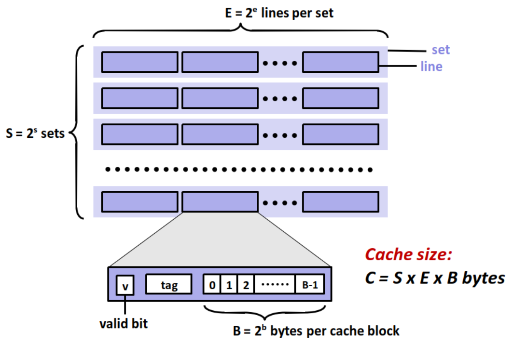
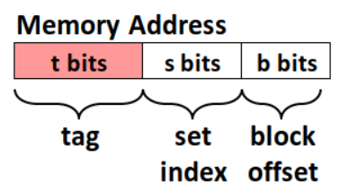

# Cache

# 배경 개념
## locality
'지역성', 프로세서가 짧은 시간동안 동일한 메모리 위치의 set에 반복적으로 접근하는 경향. 
 
cache의 적중률(Hit rate)를 극대화하기 위해 지역성을 활용한다. 
- **Spartial Locality**: 최근 사용했던 주소값 근처의 주소들에 접근하는 경향. 

- **Temporal Locality**: 최근 사용했던 주소값을 다시 접근하는 경향.

## 속도와 크기의 반비례 관계
컴퓨터 구조에서 메모리의 속도와 용량은 반비례 관계를 가진다. 
- 속도가 빠른 메모리일수록 용량이 작다.
- 용량이 큰 저장장치는 속도가 느리다.
- 둘 다 충족하는 경우 가격이 비싸다.
- 때문에 데이터 저장공간은 특성에 맞게 역할을 나누어 사용한다. 
## 메모리 계층구조
 **SRAM (Static Ram)**: 한번 저장된 데이터를 전원이 공급되는 동안 계속 유지하는 메모리 유형. refresh를 필요로 하지 않는다. 
  
 **DRAM(Dynamic Ram)**: 전원이 꺼지면 저장된 정보가 손실되는 휘발성 스토리지. 주기적인 refresh가 필요하다.

---

---
   

# Cache란 무엇인가? 

## 핵심 개념
크고 느린 디바이스에 저장된 데이터 객체를 위한 준비 영역으로 사용하는 작고 빠른 저장장치. 

---

## Cache의 구성
- **Valid bit**: 유효한지 나타내는 유효 비트
- **Tag**: 동일한 집합에 들어올 수 있는 다른 블록들과 구별하기 위한 태그
- **Set Index**: 몇번 set에 저장될 수 있는지에 대한 정보
- **block Offset**: 필요한 데이터에 접근하기 위해서 몇번째 바이트에 접근해야 하는지에 대한 정보

---

## set associativity
- **Direct Mapped Cache**: memory 주소에 따라 cache에 넣을 수 있는 공간을 제한하는 방식. 특성 memory 주소는 특정 cache의 block에만 들어갈 수 있다. 

- **Fully Associative Cache**: block이 cache의 아무 장소에 들어갈 수 있는 방식. 캐시에서 데이터를 찾을 때 모든 entry를 검색해야 한다. 

---

## Cache Hit & Cache Miss
**Cache Hit**: 필요로 하는 데이터 객체를 현재 레벨에 저장된 블록 중에서 찾을 때, 해당 데이터가 우연히 캐시되어 있어 빠르게 읽어올 수 있는 경우
**Cache Miss**: 데이터가 캐시되어 있지 않은 경우
- cold miss: 해당 메모리 주소를 처음 불렀기 때문에 발생하는 미스.
- conflict miss: 두 데이터가 같은 메모리 주소에 할당되어서 발생하는 미스.
- capacity miss: 캐시 메모리에 공간이 부족해서 발생하는 미스.  

---

## Cache Policy
빠른 연산을 위해 제한적인 캐시 메모리를 효율적으로 사용해야 한다. 이를 위해 어떤 정보를 오래 저장할 것인지에 대한 알고리즘이 Cache Policy.

- **Random**: 무작위로 제거하는 알고리즘
- **FIFO(First In First Out)**: 캐시 메모리에서 가장 먼저 들어온 데이터 순으로 제거하는 알고리즘
- **LRU(Least Recently Used)**: 캐시 메모리에서 가장 오랫동안 사용하지 않은 데이터 순으로 제거하는 알고리즘
- **LFU(Least Frequently Used)**: 캐시 메모리에서 가장 사용 횟수가 적은 데이터 순으로 제거하는 알고리즘

---
   

## 면접 예상 질문
**Q1. 캐시란 무엇인가요?**  
**A.** 캐시는 CPU의 성능을 향상시키기 위해 사용되는 메모리 계층 구조 중 **가장 빠른 메모리**입니다. CPU가 자주 사용하는 데이터를 **미리 읽어와 캐시에 저장**하면, 다음에 사용할 때 메인 메모리보다 더 빠르게 접근할 수 있습니다.

**Q2. 캐시 전략을 선택하는 방법에는 어떤 것이 있나요?**  
**A.** 대표적인 캐시 전략으로는 random, LRU, LFU, 그리고 FIFO가 있습니다. **random**은 말그대로 무작위로 데이터를 삭제하는 전략입니다.  **LRU**는 가장 최근에 사용되지 않은 데이터를 삭제하는 방식이고, **LFU**는 가장 사용빈도가 낮은 데이터를 삭제하는 전략입니다. 그리고 **FIFO**는 가장 먼저 들어온 데이터를 삭제하는 방식입니다. 

---